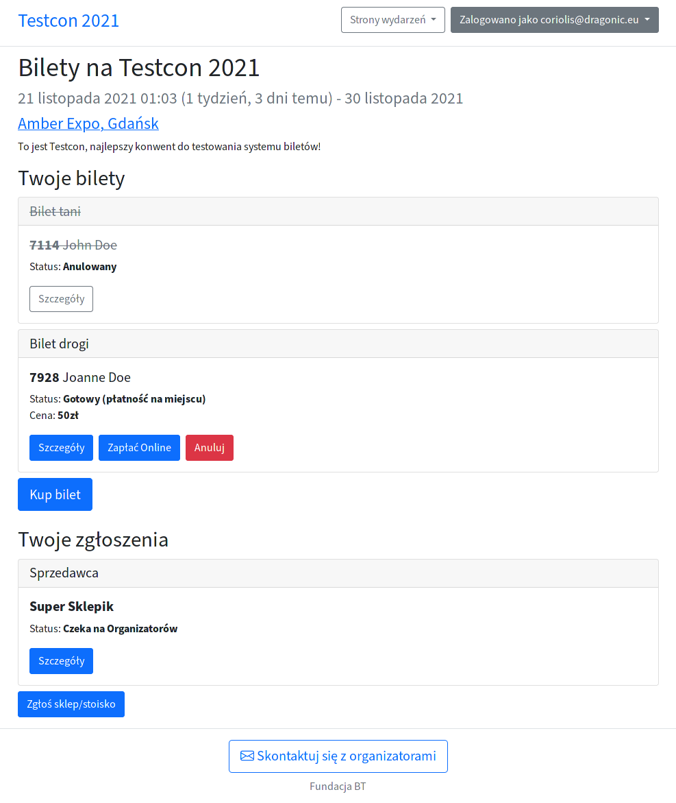

# Coriolis

A small event management and ticketing utility.

- Sell various ticket types with badge personalization (nickname, [avatar](https://github.com/DragoonAethis/Coriolis/wiki/Ticket-Preview-Generator))
- Provide applications (for volunteering, stalls, etc) with [customizable forms](https://github.com/DragoonAethis/Coriolis/wiki/Dynamic-Application-Forms)
- Lightweight event/global pages system w/ Markdown support (for ToS, policies, etc)
- Integrates with django-payments (currently Przelewy24, a Polish payment gateway)
- Available in English and Polish

## Development

Requirements:

- Primarily developed and tested on Linux, but should work on Windows/macOS too.
- You'll need Python 3.9+ with [Poetry](https://python-poetry.org/).
- For the database, you'll need PostgreSQL 13+.
- Optional: You might want to use [Mailhog](https://github.com/mailhog/MailHog) as a fake SMTP server.

Setting up the environment:

- Clone this repo and copy `.env.dist` into a new file for your dev/prod environment.
- Configure your environment per instructions in that environment file.
- Set the `ENV_PATH` path to your newly-created `.env` file or load its contents as environment variables.
- Optional: To create the `.venv` in the project directory, run `poetry config virtualenvs.in-project true`.
- Run `poetry install` to create a virtualenv with all project dependencies.
- Run `poetry shell` to enter the virtualenv (whenever it's in the repo or the Poetry venv cache).
- Run `./manage.py migrate` to set up the database for the first time.
- Run `./manage.py createsuperuser` to set up your first user account.

You're now ready to run the development server:

- You can either load `.env` contents as environment variables or point the `ENV_PATH` variable at it.
- Run `ENV_PATH=path/to/your/.env ./manage.py runserver` to start the development server.
- If you got the `ImproperlyConfigured`, this means the env vars from this file were not loaded.
- For non-production environments, the top bar will be tinted red.

Common development tasks:

- `./manage.py makemessages -l pl -i contrib` - generate translation PO files for the `pl` locale.
- `./manage.py compilemessages` - compile all available PO files into MO files (used by the app).
- `./manage.py makemigrations` - generate database migrations after introducing changes in our models.
- `./manage.py migrate` - apply missing migrations to your currently-running database.
- `./manage.py collectstatic` - generate complete contents of the `static` directory (required for prod).
- `./upgrade.sh` - pulls the current Git branch and runs common upgrade steps, then restarts the service.

## Production

- Set up the `.env` with non-debug, production values as noted on the Django Checklist.
- Set up your PostgreSQL database with backups and no access from the internet.
- Get credentials for a proper production SMTP server to send mails from.
- Set up the virtualenv with `...in-project true`, `poetry install`, `poetry shell`.
- Run `./manage.py` commands: `collectstatic`, `migrate` and `createsuperuser`.
- Deploy Django with Gunicorn: https://docs.djangoproject.com/en/3.2/howto/deployment/wsgi/gunicorn/
- Run a reverse proxy with Nginx: https://docs.gunicorn.org/en/latest/deploy.html
- Set up a 2nd domain for user uploads (MEDIA_URL) and expose the MEDIA_ROOT contents there.
- Make sure your production server has HTTPS configured: https://certbot.eff.org/
- Lock down SSH access via pubkeys only
- Block any non-SSH/HTTP/HTTPS conns via your firewall (ufw/firewalld/iptables)

Check out the `contrib` directory for some handy scripts and configs.
